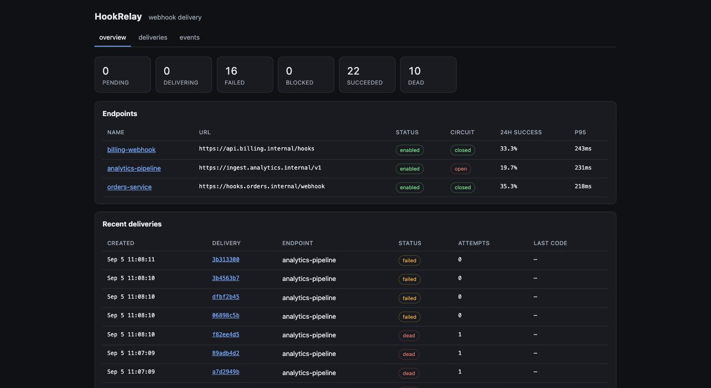
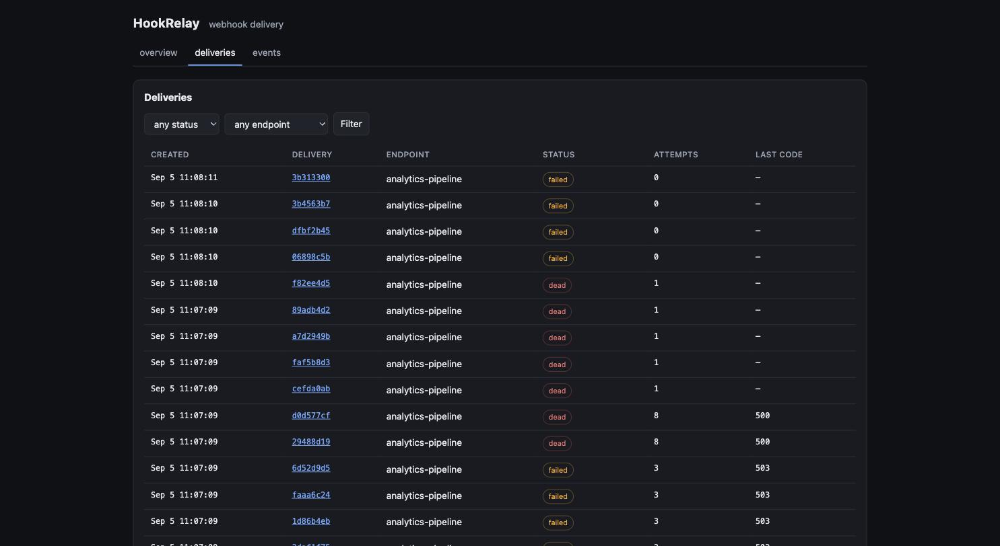
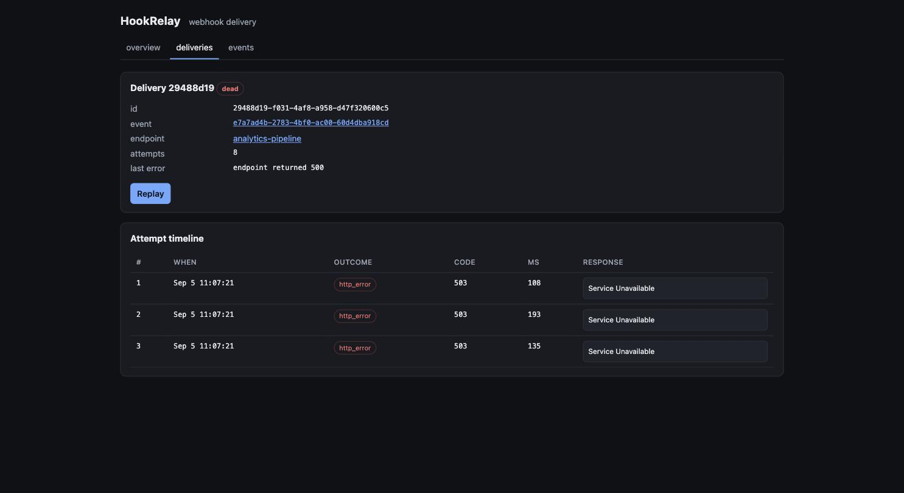
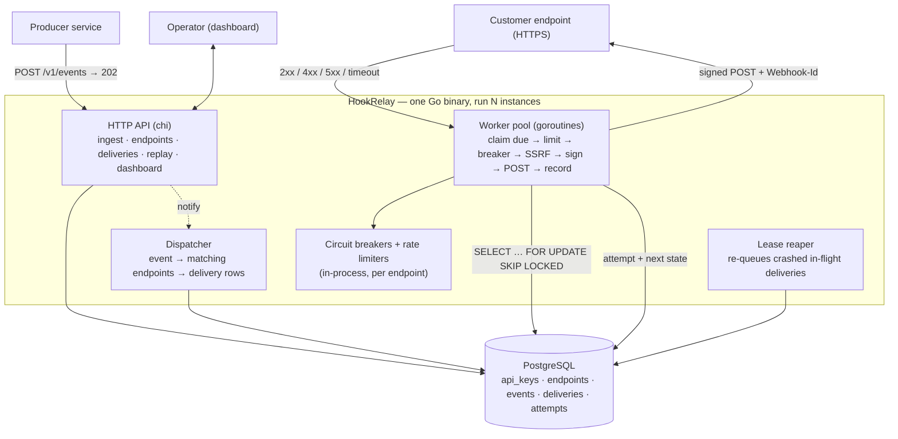

# HookRelay

An **outbound-webhook delivery service**. Producers `POST /v1/events`; HookRelay
fans each event out to every subscribed endpoint, signs the payload, retries
failures on an exponential backoff, isolates slow or dead endpoints with a
per-endpoint circuit breaker, dead-letters what never succeeds, and gives
operators a dashboard to inspect every delivery attempt and replay any of them.

The infrastructure Stripe, GitHub, Shopify and Svix each built internally for
their outbound webhooks — as a self-hostable Go service. One static binary +
Postgres. No message broker.

Go 1.26 · chi · pgx + sqlc · Postgres · HTMX. ~50 tests (unit + Testcontainers),
staticcheck-clean, CI, Docker.





---

## Architecture



**Delivery pipeline** (per claimed delivery)

1. **Claim** — `SELECT … FOR UPDATE SKIP LOCKED` on due rows; take a lease
   (`locked_until`) and bump `attempt_count` *now*, so a crash can't cause
   unbounded retries. Many workers/instances pull disjoint batches with no
   coordinator.
2. **Gate** — endpoint paused? release. Rate-limited? reschedule ~250 ms out,
   no attempt. Circuit open? mark `blocked` for the cooldown, no attempt (one
   delivery per cooldown becomes the half-open probe). Host resolves to a
   private / metadata IP *now*? `ssrf_blocked` → dead-letter (DNS-rebinding
   defence).
3. **Sign + POST** — Standard Webhooks scheme:
   `Webhook-Signature: v1,<base64(HMAC-SHA256(secret, "<id>.<ts>.<body>"))>`
   plus `Webhook-Id` (the delivery id, stable across retries, so receivers
   dedupe) and `Webhook-Timestamp`. POST with the endpoint's timeout.
4. **Record** — one `attempts` row (headers with the signature redacted, status,
   2 KB response snippet, duration, outcome) and the delivery's next state, in
   one transaction. `2xx` → `succeeded`; `429` honours `Retry-After` and leaves
   the breaker untouched; otherwise schedule the next attempt from the
   equal-jitter backoff table, or `dead` once `max_attempts` is reached — which
   emits a `delivery.dead` event so the producer can alert.

Full design: [`docs/system-design.md`](docs/system-design.md) ·
build log: [`docs/milestones.md`](docs/milestones.md).

---

## Quickstart

Needs Docker (Postgres) and Go 1.26.

```bash
make up            # Postgres on host port 5435
make run            # migrations run on boot; http://localhost:8080

# dashboard: http://localhost:8080/?token=dev-admin-token-change-me  (HTTP Basic after)
```

Register an endpoint and send an event:

```bash
ADMIN=dev-admin-token-change-me

KEY=$(curl -sXPOST localhost:8080/v1/api-keys -H "Authorization: Bearer $ADMIN" \
  -d '{"name":"producer"}' | jq -r .api_key)

curl -sXPOST localhost:8080/v1/endpoints -H "Authorization: Bearer $ADMIN" -d '{
  "name":"orders-service",
  "url":"https://example.com/webhooks/in",
  "filter":{"mode":"types","types":["order.*","invoice.paid"]}
}' | jq                        # returns the signing secret once

curl -sXPOST localhost:8080/v1/events -H "Authorization: Bearer $KEY" \
  -d '{"type":"order.created","payload":{"id":"ord_123","total":4999}}'
# → 202 {"id":"…","deduped":false}   then it's delivered within ~1s
```

**Verifying a signature** (receiver side):

```
signed = "<Webhook-Id>.<Webhook-Timestamp>.<raw body>"
expected = base64(HMAC_SHA256(endpoint_secret, signed))
accept if Webhook-Signature contains "v1,<expected>" AND |now - Webhook-Timestamp| < 5min
```

**Tests:** `make test` — spins up a throwaway Postgres via Testcontainers
(needs Docker); the pure units (`filter`, `ssrf`, `signing`, `breaker`,
`limiter`, `secretbox`, `apikey`) need nothing.

---

## Design decisions & tradeoffs

- **Postgres is the queue.** `SELECT … FOR UPDATE SKIP LOCKED` + a lease column
  + a stale-lease reaper gives correct multi-consumer, at-least-once semantics
  with no broker to operate. The tradeoff — this is not a millions-per-second
  design; the claim query on `deliveries (status, next_attempt_at)` is the first
  bottleneck (batched claims + a partial index + adaptive polling push it to a
  few k/s; beyond that you shard by `endpoint_id` or move to a real broker,
  noted in the design, not built).
- **`attempt_count` is charged at claim, refunded on a no-op.** Incrementing at
  claim time bounds retries even if the worker dies mid-delivery. When a
  delivery is released without an HTTP call (paused / rate-limited), the
  increment is given back, so gates don't burn attempts.
- **Circuit-breaker & rate-limit state is in-process.** Exact for one worker
  instance, approximate across many (the *queue* is still correctly shared).
  A periodic snapshot to the `endpoints` table feeds the dashboard; the
  in-process map is the authority. v2 moves it to Redis. This is a deliberate
  scope cut, not an oversight.
- **SSRF is checked twice.** At endpoint-create time on the URL literal, and
  again at *delivery* time after DNS resolution — so a hostname that resolves
  to `10.0.0.5` or `169.254.169.254` is rejected even if it was public when the
  endpoint was registered.
- **API keys: fast hash, split key.** `hr_<lookupId><random>` — SHA-256 of the
  whole key for a constant-time compare, the non-secret `lookupId` prefix
  indexes the row. High-entropy keys don't need a slow KDF; signing secrets
  (also high-entropy, but longer-lived) are AES-256-GCM sealed at rest.
- **A replay is a new row.** `POST /v1/deliveries/{id}/replay` inserts a fresh
  delivery (new `Webhook-Id`, `is_replay = true`); the original stays as
  history. The fan-out uniqueness constraint is a partial unique index
  (`WHERE NOT is_replay`) so this doesn't collide.
- **Dashboard is server-rendered Go.** HTMX + `html/template`, every asset
  embedded — one binary, one language, a deliberate contrast to a React SPA.

---

## Out of scope (v1)

Ordered / FIFO delivery (v2: an `ordering_key` with at-most-one in-flight per
key) · Redis-backed shared breaker/rate state · multi-region HA beyond "run N
stateless instances" · a customer self-serve portal / per-customer scoped keys ·
payload transformation or content filtering · non-HTTP sinks (SQS, Kafka) ·
billing / quotas · a receiver-side verification SDK (the scheme is documented).

---

## Deploy

```bash
docker compose --profile app up --build
```

builds the static binary (distroless image, ~25 MB) and runs Postgres + the
service; migrations run on boot. Single host: point `HOOKRELAY_DATABASE_URL` at
managed Postgres, set `HOOKRELAY_ADMIN_TOKEN` and a 32-byte base64
`HOOKRELAY_SECRET_KEY`, and run one or more stateless replicas behind a load
balancer — all shared state is in Postgres.

---

## Stack

Go 1.26 · chi · pgx/v5 + sqlc (typed queries) · goose (embedded migrations) ·
PostgreSQL 16 · `golang.org/x/time/rate` · `log/slog` · prometheus/client_golang ·
HTMX + `html/template` · JUnit-style `testing` + `httptest` + testcontainers-go.
