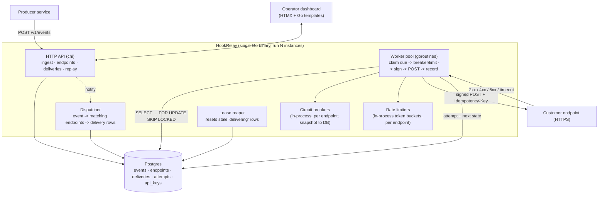

# HookRelay — System Design

## 1. Problem

Any product that notifies customers of events — a payment succeeded, a build
finished, an order shipped — sends **outbound webhooks**: an HTTP POST to a URL
the customer registered. Doing that *reliably* is a surprising amount of infra,
and almost every team reinvents it badly:

- **Naive retry loops.** A `for` loop with `time.Sleep` inside the request
  handler, or a cron that re-sends everything. No backoff, no cap, no
  dead-letter — failures either hammer the endpoint or vanish silently.
- **No signing.** The receiver can't verify the request actually came from you,
  so they can't safely act on it. Everyone reinvents an ad-hoc HMAC scheme, half
  of them without a timestamp (replayable).
- **One bad endpoint stalls everyone.** A customer's endpoint goes down or
  starts taking 30s per request; the shared worker pool fills with retries to
  that one endpoint and every other customer's webhooks back up.
- **No visibility.** When a customer says "I never got the `invoice.paid`
  webhook," there's no per-attempt log to show them the 500 their server
  returned, and no button to replay it.
- **At-least-once without help.** Retries mean duplicate deliveries, but nothing
  gives the receiver a stable key to dedupe on.

Stripe, GitHub, Shopify, Twilio, and Svix all built a dedicated service for
this. HookRelay is that service, self-hostable: point your event stream at it
and it owns fan-out, signing, retries, isolation, dead-lettering, and the
operator dashboard.

## 2. Users & use cases

| User | Goal |
| --- | --- |
| **Producer service** (the API caller) | `POST /v1/events` with a type and a JSON payload; get a 202 back in single-digit milliseconds and stop worrying about delivery. |
| **Platform / on-call engineer** | See delivery health at a glance; find why endpoint X is failing; replay a delivery or a whole event; rotate an endpoint's signing secret. |
| **The customer's receiving service** | Verify the signature, dedupe on the idempotency key, return 2xx. If it was down, trust that HookRelay will retry on a sane schedule. |
| **Whoever operates HookRelay** | Register endpoints and their event-type filters; set per-endpoint rate limits and timeouts; watch the queue depth and circuit-breaker states. |

### Core journeys

1. **Ingest an event** — producer `POST /v1/events {type, payload,
   idempotency_key?}` → event stored (deduped) → fanned out to every endpoint
   whose filter matches → one `delivery` row per (event, endpoint), due now.
2. **Deliver** — a worker claims due deliveries, and for each: check the
   endpoint's circuit breaker and rate limit, sign the body, POST it with the
   delivery id as `Idempotency-Key`, record the attempt. 2xx → `succeeded`;
   otherwise schedule the next attempt from the backoff table, or `dead` once
   attempts are exhausted.
3. **Isolate a bad endpoint** — after N consecutive failures the endpoint's
   circuit opens: HookRelay stops attempting deliveries to it for a cooldown
   (they just sit due), so one dead endpoint can't consume worker capacity or
   drown healthy traffic. A single probe after the cooldown closes or re-opens
   it.
4. **Investigate + replay** — operator filters the deliveries feed to
   `endpoint=…, status=failed`, opens one, reads the per-attempt timeline
   (status code, response snippet, timing), and hits **replay** to enqueue a
   fresh delivery.

## 3. Requirements

### Functional

- **Event ingest**: `POST /v1/events` authenticated by an API key. Body:
  `{type, payload (JSON), idempotency_key?, occurred_at?}`. Returns `202` with
  the event id. Deduplicated by `(api_key, idempotency_key)` when a key is
  supplied.
- **Endpoints**: CRUD. Each has `url`, a generated `secret`, an event-type
  filter (exact types and/or `prefix.*` globs, or `*` for all), `status`
  (enabled/disabled/paused), `rate_limit_rps`, `timeout_ms`, `max_attempts`.
- **Fan-out**: on ingest, create one `delivery` per enabled endpoint whose
  filter matches the event type. Fan-out itself is idempotent — re-processing an
  event never double-creates deliveries.
- **Signing**: each request carries
  `Webhook-Id`, `Webhook-Timestamp`, and
  `Webhook-Signature: v1,<base64(hmac_sha256(secret, "<id>.<ts>.<body>"))>`
  (the [Standard Webhooks](https://www.standardwebhooks.com/) scheme). The
  receiver verifies the HMAC and rejects timestamps outside a tolerance window.
- **Retry**: on non-2xx / timeout / connection error, schedule the next attempt
  from a fixed backoff table with jitter; after `max_attempts` the delivery goes
  to `dead` (dead-letter) and a `delivery.dead` internal event fires.
- **Idempotency for receivers**: the `Webhook-Id` header is the delivery id and
  is stable across every retry of that delivery, so the receiver can dedupe.
- **Circuit breaker per endpoint**: `closed → open` after
  `breaker_threshold` consecutive failed deliveries; `open → half-open` after
  `breaker_cooldown`; one probe delivery in half-open decides `→ closed` (2xx)
  or `→ open` (else). While open, deliveries to that endpoint are not attempted.
- **Rate limit per endpoint**: token bucket at `rate_limit_rps`; a delivery that
  would exceed it is re-scheduled a few hundred ms out instead of dropped.
- **SSRF guard**: reject endpoint URLs (at create time *and* at delivery time,
  after DNS resolution) that resolve to loopback, link-local, private, or
  cloud-metadata (`169.254.169.254`) addresses, unless an allowlist opt-in is
  set (for local testing).
- **Replay**: `POST /v1/deliveries/{id}/replay` (new delivery, fresh attempt
  counter) and `POST /v1/events/{id}/replay` (re-fan-out to all currently
  matching endpoints).
- **Query API**: list/filter deliveries and read a delivery's attempt timeline;
  list events; endpoint health summary.
- **Dashboard**: deliveries feed with filters, per-delivery attempt timeline,
  endpoint health (circuit state, success rate, p95 latency), replay button,
  secret rotation, pause/resume endpoint.
- **Ops**: `/healthz`, `/readyz`, `/metrics` (Prometheus), structured logs.

### Non-functional

- **Ingest latency**: `POST /v1/events` returns in **p99 < 15 ms** — it only
  writes the event row and signals the dispatcher; fan-out is asynchronous.
- **Delivery throughput**: a single worker instance sustains **≥ 500
  attempts/s** against fast endpoints; workers scale horizontally by adding
  instances (claim-based queue, no coordinator).
- **Delivery latency (happy path)**: a healthy endpoint receives an event within
  **~1 s** of ingest (dispatcher signal + one worker poll interval).
- **Durability / semantics**: **at-least-once**. Every delivery and attempt is
  persisted before and after the HTTP call. A worker crash mid-delivery loses no
  data — a reaper re-queues deliveries stuck in `delivering` past a lease.
- **Isolation**: one endpoint returning 30 s per request must not raise p95
  delivery latency for other endpoints by more than its share of worker slots;
  the circuit breaker bounds that share to ~one in-flight probe.
- **Consistency**: fan-out and retry scheduling are exactly-consistent with the
  DB (they *are* DB writes). Circuit-breaker and rate-limit state are
  approximate and in-process in v1 (per-instance); documented.
- **Security**: API-key auth for ingest, HMAC signing for delivery, admin bearer
  for the dashboard/query API. Secrets stored encrypted at rest. SSRF guard.
  No payload logging beyond a truncated response snippet.
- **Cost**: one Go binary + Postgres. Redis optional (only for shared
  breaker/rate state across many instances).

## 4. Scope

### In scope for v1

- Event ingest with idempotency-key dedupe; endpoint CRUD with type filters.
- Fan-out; Standard Webhooks signing; `Idempotency-Key` per delivery.
- Worker pool: claim due deliveries with `SELECT … FOR UPDATE SKIP LOCKED`,
  lease via a `delivering` status + `locked_until`, stale-lease reaper.
- Exponential backoff retry table with jitter; dead-letter.
- Per-endpoint circuit breaker (in-process) with DB-persisted state for the
  dashboard.
- Per-endpoint token-bucket rate limit (in-process).
- SSRF guard at create + delivery time.
- Replay (single delivery, whole event); secret rotation; pause/resume.
- Query API + an HTMX/Go-template dashboard.
- Postgres migrations, Docker + Compose, CI, tests, Prometheus metrics.

### Explicitly out of scope for v1

- **Ordered delivery** (global or per key). v1 is unordered; v2 adds an
  optional per-`ordering_key` FIFO per endpoint.
- **Redis-backed shared** circuit-breaker / rate-limit state. v1 breaker/limit
  state is per-instance; correct for a single worker instance, approximate
  across many. (The queue itself *is* correctly shared via Postgres.)
- Multi-region / HA beyond "run N stateless instances".
- A customer-facing self-serve portal, OAuth, per-customer API keys with scopes.
- Payload transformation / templating / filtering on payload contents.
- Non-HTTP sinks (SQS, Kafka, gRPC).
- Billing / quota enforcement.
- Inbound webhook *receiving/verification* helper libraries (that's the
  receiver's side; we document the scheme).

### Possible v2

- Ordered mode: `ordering_key` on the event → at most one in-flight delivery
  per (endpoint, key), retries block the key's queue.
- Redis for shared breaker + rate-limit state; horizontal worker scaling with
  consistent isolation.
- Endpoint-level "disable after M days dead" + customer email on circuit-open.
- Signed-payload rotation window (two active secrets during rotation).
- A tiny receiver SDK (Go + TS) that verifies signatures.
- Delivery search by payload field (JSONB GIN index).
- OpenTelemetry traces spanning ingest → fan-out → attempt.

## 5. Architecture



### Component responsibilities

- **API (chi)** — event ingest (write `events`, signal the dispatcher), endpoint
  CRUD (with SSRF validation + secret generation), deliveries/attempts query,
  replay, secret rotation, dashboard routes.
- **Dispatcher** — consumes newly-ingested event ids (from an in-process channel,
  with a periodic sweep as a safety net for missed signals) and expands each
  into `deliveries` rows: `INSERT … SELECT` over endpoints whose compiled filter
  matches the event type, `ON CONFLICT (event_id, endpoint_id) DO NOTHING` for
  idempotency.
- **Worker pool** — `N` goroutines. Each: claim a batch of due deliveries
  (`status IN ('pending','failed') AND next_attempt_at <= now()`, `FOR UPDATE
  SKIP LOCKED`, set `status='delivering', locked_until=now()+lease`); for each
  claimed delivery run the **delivery pipeline** (§8.4); write the `attempt` row
  and the delivery's next state in one transaction.
- **Circuit breakers** — a `map[endpointID]*Breaker` guarded by a mutex.
  `Allow()` before a delivery; `RecordSuccess/RecordFailure` after. State +
  counters snapshotted to `endpoints.breaker_state` every few seconds for the
  dashboard.
- **Rate limiters** — `map[endpointID]*rate.Limiter` (`golang.org/x/time/rate`).
  A delivery denied by the limiter is released with
  `next_attempt_at = now() + 250ms±jitter`.
- **Lease reaper** — every ~10 s: `UPDATE deliveries SET status='failed' …
  WHERE status='delivering' AND locked_until < now()` so a crashed worker's
  in-flight deliveries become due again (counts as a failed attempt with reason
  `worker_lost`).
- **Postgres** — source of truth *and* the queue. No broker.

### Main path (one event, one matching endpoint, endpoint healthy)

1. `POST /v1/events {type:"invoice.paid", payload:{…}}` → insert `events` row →
   return `202 {id}` → send the event id on the dispatcher channel.
2. Dispatcher: `INSERT INTO deliveries (event_id, endpoint_id, status,
   next_attempt_at) SELECT :event, e.id, 'pending', now() FROM endpoints e
   WHERE e.status='enabled' AND match(e.filter, :type) ON CONFLICT DO NOTHING`.
3. A worker's next poll claims the row (`→ delivering`, lease set).
4. Breaker `Allow()` = true; limiter `Allow()` = true.
5. Resolve the URL host, re-check it isn't a private/metadata IP.
6. Build headers: `Webhook-Id = delivery.id`, `Webhook-Timestamp = now`,
   `Webhook-Signature = v1,<b64 hmac>`. POST the body with `timeout_ms`.
7. Response `200` → insert `attempts` row (n=1, status 200, 42 ms) →
   `UPDATE deliveries SET status='succeeded', delivered_at=now()`. Breaker
   `RecordSuccess`.

### Failure path

- **Endpoint returns 503** → `attempts` row (status 503, body snippet) →
  `attempt_count += 1`; if `< max_attempts`: `status='failed',
  next_attempt_at = now() + backoff[attempt_count] ± jitter`; else
  `status='dead'` and enqueue a `delivery.dead` event. Breaker `RecordFailure`.
- **Timeout / connection refused** → same as a 5xx, reason recorded as
  `timeout` / `connection_error`.
- **Breaker open** → delivery is *not* attempted; it's released with
  `next_attempt_at = now() + breaker_cooldown` and no attempt row (the dashboard
  shows "blocked by circuit"). One delivery per cooldown becomes the half-open
  probe.
- **4xx (except 429)** → treated as permanent for that attempt but still
  retried up to a lower cap (`max_4xx_attempts`, default 3) — a 400 today might
  be a deploy bug fixed in an hour; a 410 Gone disables the endpoint.
- **429** → honour `Retry-After` if present, else back off; does **not** count
  toward the breaker (it's flow control, not failure).
- **Worker crash mid-POST** → row stuck in `delivering`; reaper flips it to
  `failed` after the lease expires → retried. At-least-once holds (the customer
  may have received it; that's what `Idempotency-Key` is for).
- **Postgres down** → ingest returns `503`; workers idle and retry the claim
  query with backoff; no deliveries lost.
- **Dispatcher misses a signal** (channel full / instance restart) → the 30 s
  safety sweep (`SELECT id FROM events WHERE fanned_out=false`) catches it.

## 6. Data model (Postgres)

```
api_keys
  id            uuid pk
  name          text
  key_hash      text          -- sha256 of the raw key; raw shown once
  key_prefix    text          -- first 8 chars, for lookup + display
  created_at    timestamptz
  disabled_at   timestamptz null

endpoints
  id              uuid pk
  name            text
  url             text
  secret_enc      bytea         -- AES-GCM(sealed) signing secret
  filter          jsonb         -- {"mode":"all"} | {"mode":"types","types":["invoice.*","order.created"]}
  status          text          -- enabled | disabled | paused
  rate_limit_rps  int           default 0        -- 0 = unlimited
  timeout_ms      int           default 10000
  max_attempts    int           default 12
  breaker_state   text          default 'closed' -- snapshot: closed | open | half_open
  breaker_open_until timestamptz null
  consecutive_failures int      default 0
  created_at      timestamptz
  updated_at      timestamptz

events
  id             uuid pk
  api_key_id     uuid fk -> api_keys
  type           text
  payload        jsonb
  idempotency_key text null
  occurred_at    timestamptz
  received_at    timestamptz   default now()
  fanned_out     bool          default false
  UNIQUE (api_key_id, idempotency_key)          -- partial: WHERE idempotency_key IS NOT NULL
  INDEX (fanned_out) WHERE fanned_out = false
  INDEX (type), INDEX (received_at)

deliveries                     -- one row per (event, endpoint); this is the queue
  id               uuid pk     -- also the Webhook-Id sent to the receiver
  event_id         uuid fk -> events (on delete cascade)
  endpoint_id      uuid fk -> endpoints (on delete cascade)
  status           text        -- pending | delivering | succeeded | failed | dead | blocked
  attempt_count    int         default 0
  next_attempt_at  timestamptz default now()
  locked_until     timestamptz null            -- worker lease
  locked_by        text null                   -- instance id, for debugging
  last_status_code int null
  last_error       text null
  delivered_at     timestamptz null
  created_at       timestamptz default now()
  UNIQUE (event_id, endpoint_id)
  INDEX (status, next_attempt_at)               -- the claim query's index
  INDEX (endpoint_id, created_at)
  INDEX (status) WHERE status = 'delivering'    -- reaper

attempts
  id              bigserial pk
  delivery_id     uuid fk -> deliveries (on delete cascade)
  n               int                            -- 1-based attempt number
  request_headers jsonb                          -- sent headers (signature redacted to prefix)
  status_code     int null
  response_snippet text null                     -- first 2 KB of the body
  duration_ms     int
  outcome         text        -- success | http_error | timeout | connection_error | worker_lost | ssrf_blocked
  error           text null
  attempted_at    timestamptz default now()
  INDEX (delivery_id, n)

-- circuit-breaker + rate-limit runtime state is in-process (Go maps);
-- endpoints.breaker_* columns are a periodic snapshot for the dashboard only.
```

## 7. API surface

Auth: `Authorization: Bearer <API_KEY>` for `/v1/events`; `Authorization:
Bearer <ADMIN_TOKEN>` for everything else. `/healthz` is open.

### Ingest

| Method | Path | Notes |
| --- | --- | --- |
| POST | `/v1/events` | Body `{type, payload, idempotency_key?, occurred_at?}`. `202 {id, deduped:false}`. On idempotency-key hit: `200 {id, deduped:true}`. `413` over a payload size cap (default 256 KB). |

### Endpoints (admin)

| Method | Path | Purpose |
| --- | --- | --- |
| POST | `/v1/endpoints` | Create. Body `{name, url, filter, rate_limit_rps?, timeout_ms?, max_attempts?}`. Returns the record + the signing `secret` (once). SSRF-validates `url`. |
| GET | `/v1/endpoints` · `/v1/endpoints/{id}` | List / detail (with health: circuit state, 24 h success rate, p95 attempt latency). |
| PATCH | `/v1/endpoints/{id}` | Update url/filter/limits/status (`paused` stops new attempts but keeps deliveries due). |
| DELETE | `/v1/endpoints/{id}` | Remove (cascades deliveries). |
| POST | `/v1/endpoints/{id}/rotate-secret` | New secret; returns it once. |
| POST | `/v1/endpoints/{id}/reset-breaker` | Force the circuit closed. |

### Deliveries & events (admin)

| Method | Path | Purpose |
| --- | --- | --- |
| GET | `/v1/deliveries?endpoint_id&event_id&status&from&to&limit&cursor` | Filtered, cursor-paginated feed. |
| GET | `/v1/deliveries/{id}` | Delivery + its full `attempts` timeline. |
| POST | `/v1/deliveries/{id}/replay` | Enqueue a **new** delivery for the same (event, endpoint); returns the new id. |
| GET | `/v1/events?type&from&to&limit&cursor` · `/v1/events/{id}` | Event list / detail (with its deliveries). |
| POST | `/v1/events/{id}/replay` | Re-fan-out to all endpoints currently matching the event's type. |

### Ops & dashboard

| Method | Path | Purpose |
| --- | --- | --- |
| GET | `/` , `/endpoints/{id}` , `/deliveries/{id}` | HTMX dashboard pages. |
| GET | `/healthz` · `/readyz` · `/metrics` | Liveness · readiness (DB) · Prometheus. |

### Error envelope

```json
{ "error": { "type": "hookrelay_ssrf_blocked",
             "message": "url resolves to a private address (10.0.0.5)",
             "code": 422 } }
```

## 8. Key algorithms / mechanisms

### 8.1 Event-type filter matching

A filter is `{"mode":"all"}` or `{"mode":"types","types":[…]}` where each entry
is an exact type (`order.created`) or a single-level-or-deeper glob
(`invoice.*`, `*`). Compiled once per endpoint into a matcher:

```
match(filter, type):
  if filter.mode == "all": return true
  for pat in filter.types:
    if pat == "*": return true
    if pat == type: return true
    if strings.HasSuffix(pat, ".*") and
       (type == pat[:-2] or strings.HasPrefix(type, pat[:-1])): return true
  return false
```

Fan-out does the match in SQL for speed via a lateral join over a small
in-memory endpoint cache refreshed on endpoint writes; the Go matcher above is
the reference and the test oracle.

### 8.2 Retry backoff schedule

Fixed table, indexed by attempt number, with full jitter:

```
base = [15s, 45s, 2m, 5m, 15m, 45m, 2h, 5h, 10h, 12h, 12h, 12h]   // len == default max_attempts
delay(n) = base[min(n-1, len-1)]
next_attempt_at = now() + random_between(delay/2, delay)          // "equal jitter"
```

- 4xx (non-429) uses `min(n, max_4xx_attempts=3)` before `dead`.
- 429 with `Retry-After: <n>` → `next_attempt_at = now() + n`, capped at 1 h.
- A `dead` delivery emits a `delivery.dead` event (so producers can alert), and
  is still replayable by an operator.

### 8.3 Claim query + lease (Postgres as a work queue)

```sql
WITH due AS (
  SELECT id FROM deliveries
  WHERE status IN ('pending','failed')
    AND next_attempt_at <= now()
  ORDER BY next_attempt_at
  FOR UPDATE SKIP LOCKED
  LIMIT :batch
)
UPDATE deliveries d
SET status = 'delivering',
    locked_until = now() + :lease,       -- e.g. timeout_ms + 30s
    locked_by = :instance_id,
    attempt_count = attempt_count + 1
FROM due
WHERE d.id = due.id
RETURNING d.*;
```

- `SKIP LOCKED` lets many workers/instances pull disjoint batches with no
  coordinator and no double-delivery *within* a claim.
- The lease (`locked_until`) covers the window between claim and the final
  `UPDATE`. If the worker dies, the **reaper** (`status='delivering' AND
  locked_until < now()`) flips the row back to `failed` — recorded as a
  `worker_lost` attempt so it counts toward `max_attempts`.
- `attempt_count` is incremented **at claim time** so a crash can't cause
  unbounded retries.

### 8.4 The delivery pipeline (per claimed delivery)

```
if endpoint.status == 'paused':            release(next = now()+1m); return
if !breaker[endpoint].Allow():             mark 'blocked'; release(next = breaker_open_until); return
if !limiter[endpoint].Allow():             release(next = now()+250ms±jitter); return   // no attempt row

ip := resolve(endpoint.url.host)
if isPrivateOrMetadata(ip):                record attempt{outcome: ssrf_blocked}; dead(); return

body := event.payload (canonical JSON bytes)
id, ts := delivery.id, now_unix()
sig := "v1," + base64(hmac_sha256(secret, id + "." + ts + "." + body))
headers := {Webhook-Id: id, Webhook-Timestamp: ts, Webhook-Signature: sig,
            Content-Type: application/json, User-Agent: HookRelay/1.x}

resp, err := httpClient.Do(POST url, body, headers, timeout = endpoint.timeout_ms)

record attempt{n, headers (sig -> "v1,***"), status, snippet(resp, 2KB), duration, outcome}
switch {
  case err is timeout:            fail(reason=timeout);           breaker.RecordFailure()
  case err != nil:                fail(reason=connection_error);  breaker.RecordFailure()
  case 200 <= resp.status < 300:  succeed();                      breaker.RecordSuccess()
  case resp.status == 429:        fail(reason=throttled, honor Retry-After)   // breaker untouched
  case 400 <= resp.status < 500:  fail(reason=http_error, cap = max_4xx_attempts); breaker.RecordFailure()
  default:                        fail(reason=http_error);        breaker.RecordFailure()
}
```

`fail()` either schedules the next attempt (§8.2) or marks `dead`. All of
"record attempt + set next state" is one transaction.

### 8.5 Circuit breaker (per endpoint, in-process)

```
type Breaker struct { state; consecFail int; openedAt time.Time }

Allow():
  switch state:
    closed:    return true
    open:      if now-openedAt >= cooldown { state = half_open; return true }  // let ONE probe through
               return false
    half_open: return false   // only the single probe that flipped us here proceeds

RecordSuccess():
  consecFail = 0
  if state != closed { state = closed }

RecordFailure():
  consecFail++
  if state == half_open { state = open; openedAt = now; return }
  if state == closed and consecFail >= threshold { state = open; openedAt = now }
```

- `threshold` default 5, `cooldown` default 60 s (both per-endpoint tunable).
- The half-open probe is naturally serialised: `Allow()` returns true exactly
  once per cooldown, so at most one in-flight probe.
- State is snapshotted to `endpoints` every 5 s and on transition, purely for
  the dashboard. The **authority is the in-process map** — which is why v1 is
  "one worker instance for exact isolation; multi-instance is approximate."
  (v2: move the map to Redis.)

### 8.6 SSRF guard

At endpoint create/update: parse URL, require `https` (or `http` only if
`ALLOW_INSECURE_ENDPOINTS`), reject if the host literal is an IP in a blocked
range. At **delivery time**: resolve the host and reject if *any* resolved IP is
loopback / link-local / private / ULA / `169.254.169.254` / `::ffff:` mapped
equivalents — this defeats DNS-rebinding. A per-endpoint `allow_private` flag
(default false) exists only for local testing against `host.docker.internal`.

### 8.7 Idempotent fan-out & replay

- Fan-out: `INSERT … ON CONFLICT (event_id, endpoint_id) DO NOTHING`, then
  `UPDATE events SET fanned_out=true`. Safe to run twice.
- `POST /events/{id}/replay`: re-runs fan-out against *current* endpoints
  (so a newly-added endpoint can be back-filled).
- `POST /deliveries/{id}/replay`: inserts a **new** delivery row (new id, new
  `Webhook-Id`) for the same (event, endpoint) with `attempt_count=0` — the
  original stays as history.

## 9. Scaling & failure modes

- **First bottleneck: the claim query.** At high delivery rates every worker
  hammers `deliveries (status, next_attempt_at)`. Mitigations: batch claims
  (default 50), a partial index on the exact predicate, and a short poll
  interval only when the last claim was full (adaptive backoff to ~1 s when
  idle). Beyond ~a few k/s you'd shard `deliveries` by `endpoint_id` hash or
  move to a real broker — noted, not built.
- **A firehose producer** — ingest is a single INSERT; the dispatcher is the
  choke point (one `INSERT … SELECT` per event). It's batched (drain the
  channel, fan out up to K events per transaction) and horizontally safe
  (`ON CONFLICT`). The 30 s sweep bounds lag if the dispatcher restarts.
- **One dead endpoint** — circuit opens after 5 failures (~seconds); after that
  it costs one probe delivery per 60 s. Healthy endpoints are unaffected because
  workers claim by `next_attempt_at`, not round-robin by endpoint.
- **One very slow endpoint (20 s, always 200)** — no circuit trip (it succeeds),
  so it *does* hold a worker slot for 20 s per attempt. Bounded by: per-endpoint
  rate limit, the global worker count, and a per-endpoint `max_in_flight` cap
  (v1: implied by rate limit; v2: explicit). Documented as the known weak spot.
- **Thundering herd after an outage** — when a downed endpoint recovers, all its
  `failed` deliveries are due at once. The per-endpoint rate limiter drains them
  at `rate_limit_rps`; without a limit set, the worker count caps it. Jitter in
  the backoff spreads the initial wave.
- **Postgres unavailable** — ingest → `503`; workers back off on the claim
  query; reaper idles. Nothing is lost, delivery just pauses. `/readyz` → 503.
- **Worker instance dies** — its leased deliveries reappear after the lease via
  the reaper; other instances keep going. No leader, no failover step.
- **Redis (v2) unavailable** — breaker/limit fall back to per-instance
  in-process state (fail-open on isolation, never on correctness).
- **Poison payload** (endpoint 500s forever on one event) — retries to
  `max_attempts` then `dead`; the `delivery.dead` event lets the producer notice;
  operator can fix the receiver and replay.

## 10. Tech / language options

| Concern | Choice | Why / tradeoff |
| --- | --- | --- |
| **Language** | **Go 1.2x** | The whole project is concurrent workers, per-request timeouts, cancellation, and backpressure — goroutines + channels + `context` are the idiomatic fit, and `net/http`'s client/server are exactly what's needed. Single static binary, trivial container. This is the deliberate "backend/platform" résumé piece. |
| HTTP | `chi` router + stdlib `net/http` | Minimal, standard, no framework lock-in. |
| DB access | `pgx` (v5) + `sqlc` for typed queries | `pgx` is the de-facto Postgres driver; `sqlc` generates typed Go from SQL so the queries stay readable and reviewable. |
| Migrations | `goose` (or `golang-migrate`) | Plain SQL up/down files; runs from the binary on boot. |
| Queue | **Postgres `SELECT … FOR UPDATE SKIP LOCKED`** | No broker to run; correct multi-consumer semantics; the same pattern proven in the earlier projects. Tradeoff: not a millions/s design — documented. |
| Rate limit | `golang.org/x/time/rate` token buckets | Standard, well-tested. |
| Dashboard | **HTMX + Go `html/template`** | One binary, one language, server-rendered — a deliberate contrast to the two React dashboards already in the portfolio, and a stronger "Go end-to-end" signal. Alternative: a small React app. |
| Metrics | `prometheus/client_golang` | Standard. |
| Tests | stdlib `testing` + `httptest` + `testcontainers-go` (Postgres) | Real Postgres in tests via a throwaway container; `httptest.Server` as the fake customer endpoint. |
| Config | env vars via `caarlos0/env` or stdlib | 12-factor. |

**Recommendation (confirm at stage 4):** Go + chi + pgx/sqlc + Postgres +
HTMX dashboard. Rationale for the language choice belongs in the
language-decision step, but Go is the entire point of this project.

## 11. What this demonstrates on a résumé

- **Concurrent delivery infrastructure in Go** — a worker pool over a Postgres
  work queue (`FOR UPDATE SKIP LOCKED` + leases + a stale-lease reaper),
  horizontally scalable with no coordinator, at-least-once with idempotency
  keys.
- **Reliability engineering** — exponential backoff with jitter, dead-letter
  queue, a per-endpoint **circuit breaker** state machine, and endpoint
  isolation so one bad consumer can't starve the rest.
- **Webhook security done right** — HMAC-SHA256 signing with a timestamp
  (Standard Webhooks / Stripe scheme, replay-resistant), secret rotation, and an
  **SSRF guard** that re-checks resolved IPs at delivery time (DNS-rebinding
  aware).
- **Rate limiting & backpressure** — per-endpoint token buckets, adaptive
  worker polling, thundering-herd control on endpoint recovery.
- **API + data modelling** — idempotent event ingest, idempotent fan-out
  (`ON CONFLICT`), a delivery/attempt schema that supports a full audit
  timeline and one-click replay.
- **Operability** — Prometheus metrics (deliveries by status, attempt-latency
  histogram, circuit-state gauge, queue depth), a server-rendered dashboard,
  `/readyz` gating on the DB, structured logs.
- **Go fluency** — `context` propagation and cancellation, `net/http` client
  tuning (timeouts, connection pooling), `sqlc`-typed queries, `testcontainers`
  integration tests.

Maps cleanly to **Backend Engineer**, **Platform / Infrastructure Engineer**,
and **Distributed Systems** job descriptions — and, with TokenGate and
SiteGuard, shows range across Python and Go.
